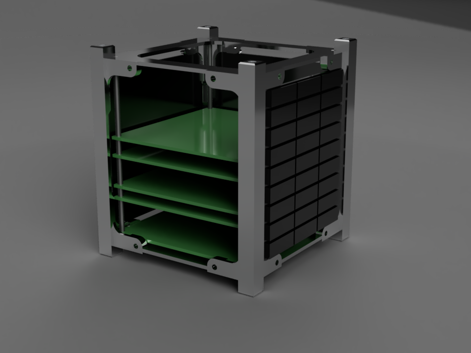

# Atomsat
Atomsat is a 12-member project, the aim of the project is to develop and launch a low-cost cubesat 1U (nano satellite in cube format 10 by 10 by 10 cm) for technology demonstration and open doors for scientific experiments in schools around the world . The launch estimate is for the beginning of 2024 and is expected to be in operation for 1 year (caused by orbital decay).
(The project is still under development, codes and PCBs are not ready)

